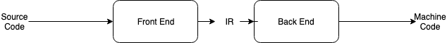
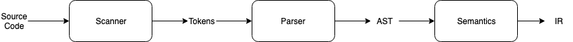
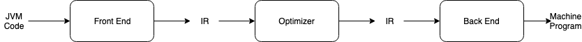
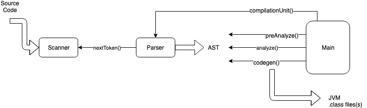

# Compilation

## 1.1 Compilers

- __Compiler__: a program that translates source code into a target program in low-level language, such as machine code. This process is called compilation.

### 1.1.1 Programming Languages

- A programming language is specified in 3 steps:

  1. The tokens, e.g. `if`, `+`, `4`.
  2. One describes the syntax, e.g. classes, methods, expressions, statements.
  3. One specifies the semantics.

## 1.3 The Phases of Compilation

### 1.3.1 Front End

- __Scanner__: responsible for breaking input stream of characters into a stream of tokens: identifiers, literals, reserved words, operators, and separators.
- __Parser__: responsible for taking this sequence of lexical tokens and parsing against a grammar to produce an abstract syntax tree (AST).
- __Semantic Phase__: responsible for semantic analysis:
  - declaring names in a symbol table
  - looking up names as they are referenced for determining their types
  - assigning types to expressions
  - checking the validity of types

### 1.3.2 Back End

- __Code Generation__: responsible for choosing what target machine instructions to generate.
- __Peephole Phase__: implements peephole optimizer, which scans through the generated instructions looking locally for wasteful instruction sequences such as branches to branches and unnecessary load/store pairs.
- __Object Phase__: links together any modules produced in code generation and constructs a single machine code executable program.

### 1.3.3 "Middle" End

- __Optimizer__: improves the IR program & collects useful info for producing better code:
  - organizes the program into basic blocks (which there are no branches out and into which there are no branches).
  - computes next-use info to determine the lifetimes of variables and loop identification.

### 1.3.4 Advantages to Decomposition

- Reduces complexity.
- Makes it possible to work concurrently on separate parts.
- Permits a certain amount of re-use.

### 1.3.6 Compiling JVM Code to a Register Architecture

Advantages of intermediate vm code representation:

- byte code
  - small
  - easy to transport
- highly optimized VMs
- partially translated into machine code

## 1.4 An Overview of the j-- to JVM Compiler

### 1.4.1 j-- Compiler Organization

Each type of node in AST has 3 methods:

- `preAnalyze(Context context)`
  - near the top of AST
  - deals with declaring imported types, defined class names, and class member headers.
  - `context` represents the compile-time symbol table of declared names and their definitions.
- `analyze(Context context)`
  - defined over all types of AST
  - declares names in the symbol table.
  - checks types.
  - converts local variables to offsets in a method's run-time local stack frame where the local variables reside.
- `condegen(CLEmitter output)`
  - generates JVM code.
  - recursively called on subtrees.

After `Main` has created the scanner and parser:

1. sends a `compilationUnit()` message to the pars; causes it to parse the program by "recursive descent" to produce an AST.
2. // TODO: finish 1.4.1

### 1.4.2 Scanner

