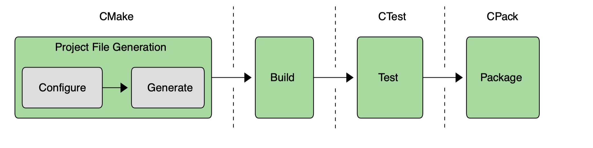
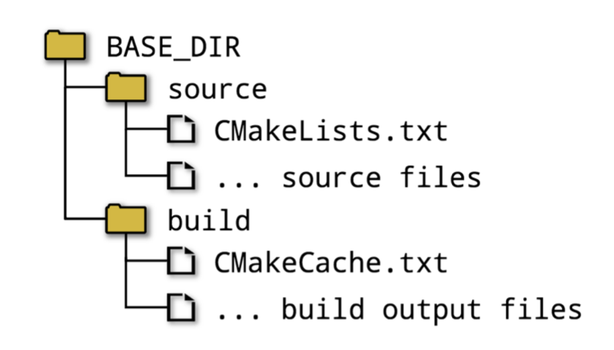

# Professional CMake (5th Edition)

[[toc]]

## Chapter 1. Introduction



## Chapter 2. Setting Up A Project

### 2.1. In-source Builds

in-source build = the source and build directories to be same

- Directories become cluttered with all sorts of files and subdirectories.
- Difficult to work with version control systems.
- Non-trivial to clear out all build output and start again with a clean source tree.

### 2.2. Out-of-source Builds

out-of-source build = keeps the sources and the build outputs completely separate from each other



### 2.3. Generating Project Files

```
mkdir build
cd build
cmake -G "Unix Makefiles" ../source
```

- If `-G` omitted, CMake will choose a default generator type based on the host platform.

### 2.4. Running The Build Tool

```
mkdir build
cd build
cmake -G "Unix Makefiles" ../source
cmake --build . --config Release --target MyApp
```

- `--build` points to the build directory used by CMake.
- `--config` specifies which configuration to build.
- `--target` tells what to build or if omitted, the default target will be built.

### 2.5. Recommended Practices

Ensure the project builds with the default generator type on each platform of interest + one other type.
