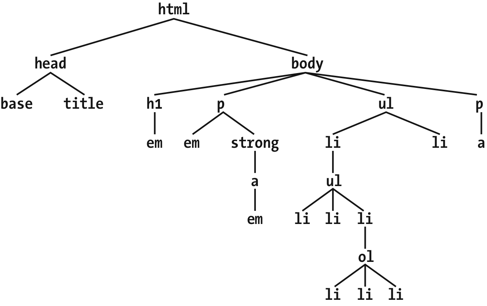
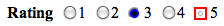
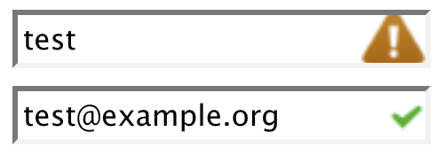
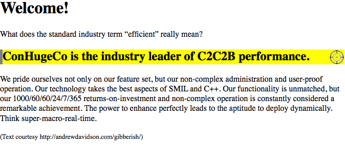

# CSS: The Definitive Guide

[[toc]]

## Chapter 2. Selectors

### Basic Style Rules

#### Element Selectors

An element selector is a selector of HTML elements.

```css
quote {color: gray;}
bib {color: red;}
booktitle {color: purple;}
myElement {color: red;}
```

#### Declarations and Keywords

```css
.box {box-shadow: inset -1px -1px white,
                  3px 3px 3px rgba(0,0,0,0.2);
      background-image: url(myimage.png),
          linear-gradient(180deg, #FFF 0%, #000 100%);
      transform: translate(100px, 200px);
}
a:hover {transition: color, background-color 200ms ease-in 50ms;}
```

### Grouping

#### Grouping Selectors

```css
/* group 1 */
h1 {color: silver; background: white;}
h2 {color: silver; background: gray;}
h3 {color: white; background: gray;}
h4 {color: silver; background: white;}
b {color: gray; background: white;}

/* group 2 */
h1, h2, h4 {color: silver;}
h2, h3 {background: gray;}
h1, h4, b {background: white;}
h3 {color: white;}
b {color: gray;}

/* group 3 */
h1, h4 {color: silver; background: white;}
h2 {color: silver;}
h3 {color: white;}
h2, h3 {background: gray;}
b {color: gray; background: white;}
```

#### The Universal Selector

The universal selector (`*`) matches any element.

- It can have unintended consequences.

#### Grouping Declarations

```css
h1 {
  font: 18px Helvetica;
  color: purple;
  background: aqua;
}
```

#### Grouping Everything

```css
h1, h2, h3, h4, h5, h6 {color: gray; background: white; padding: 0.5em;
  border: 1px solid black; font-family: Charcoal, sans-serif;}
```

### Class and ID Selectors

#### Class Selectors

A class selector selects elements by its `class` attribute:

- Always preceded by a period (`.`).

```html
<p class="warning">When handling plutonium, care must be taken to avoid
the formation of a critical mass.</p>
<p>With plutonium, <span class="warning">the possibility of implosion is
very real, and must be avoided at all costs</span>. This can be accomplished
by keeping the various masses separate.</p>
```

```css
.warning {font-weight: bold;}
```

A class selector can be combined with element selectors:

```css
p.warning {font-weight: bold;}
span.warning {font-style: italic;}
```

#### Multiple Classes

```css
p.warning.help {background: red;}
```

The above multiple class selector matches the following:

```html
<p class="urgent warning help">Help me!</p>
```

#### ID Selectors

An ID selector selects an element by its `id` attribute:

- Always preceded by `#`.

```html
<p id="lead-para">This paragraph will be boldfaced.</p>
<p>This paragraph will NOT be bold.</p>
```

```css
#lead-para {font-weight: bold;}
```

#### Deciding Between Class and ID

- ID selectors cannot be combined with other IDs.
- IDs have more weight than classes.
- Class and ID selectors are case-sensitive.

### Attribute Selectors

#### Simple Attribute Selectors

A simple attribute selector selects elements that have a certain attribute:

```html
<a href="http://www.w3.org/" title="W3C Home">W3C</a><br />
<a href="http://www.webstandards.org">Standards Info</a><br />
<a title="Not a link">dead.letter</a>
```

```css
a[href][title] {font-weight: bold;}
```

#### Selection Based on Exact Attribute Value

```html
<a href="http://www.w3.org/" title="W3C Home">W3C</a><br />
<a href="http://www.webstandards.org"
  title="Web Standards Organization">Standards Info</a><br />
<a href="http://www.example.org/" title="W3C Home">dead.link</a>
```

```css
a[href="http://www.w3.srg/"][title="W3C Home"] {font-size: 200%;}
```

- Only applied to the first `a` element.

```css
p[class="urgent warning"] {font-weight: bold;}
```

- Only selects any `p` element whose `class` attributes has exactly the value `"urgent warning"`.

#### Selection Based on Partial Attribute Values

|      Type      |                                                                   Description                                                                   |
| :------------: | :---------------------------------------------------------------------------------------------------------------------------------------------: |
| `[foo~="bar"]` |               Selects any element with an attribute `foo` whose value contains the word `bar` in a space-separated list of words.               |
| `[foo*="bar"]` |                              Selects any element with an attribute `foo` whose value contains the substring `bar`.                              |
| `[foo^="bar"]` |                                   Selects any element with an attribute `foo` whose value begins with `bar`.                                    |
| `[foo$="bar"]` |                                    Selects any element with an attribute `foo` whose value ends with `bar`.                                     |
| `[foo|="bar"]` | Selects any element with an attribute `foo` whose value starts with `bar` followed by a dash (U+002D) or whose value is exactly equal to `bar`. |

#### The Case Insensitivity Identifier

Including an `i` before `]` will allow a selector to match attribute values (not including attribute names) case-insensitively.

### Using Document Structure

#### Understanding the Parent-Child Relationship



- An element is a parent of another element if it appears directly above that element in the document hierarchy.
- An element is the child of another element if it is directly beneath the other element.
- The `html` element is the root element.

#### Descendant Selectors

A descendent selector (contextual selector) is composed of two+ space-separated selectors.

- The space between the selectors is a combinator, which could mean "found within", "which is part of", or "that is a descendent of" (right to left).
- Degree of separation between two elements can be infinite.
- The closeness of two elements within the document tree has no bearing on whether a rule applies or not.

```css
ul ol ul em {color: gray;}
```

#### Selecting Children

The child combinator (`>`) can be used to select a child.

- Can be used together with descendant selectors.

```html
<h1>This is <strong>very</strong> important.</h1>
<h1>This is <em>really <strong>very</strong></em> important.</h1>
```

```css
h1 > strong {color: red;}
```

- Only the first `strong` element is selected.

#### Selecting Adjacent Sibling Elements

The adjacent-sibling combinator (`+`) can be used to select a sibling element (note: must be the same parent).

- Text content between two elements does not prevent `+` from working.

```html
<div>
  <ol>
    <li>List item 1</li>
    <li>List item 1</li>
    <li>List item 1</li>
  </ol>
  This is some text that is part of the 'div'.
  <ul>
    <li>A list item</li>
    <li>Another list item</li>
    <li>Yet another list item</li>
  </ul>
</div>
```

```css
li + li {font-weight: bold;},
```

- Last two `li` elements in `ol` and last two `li` elements in `ul` are selected.

#### Selecting Following Siblings

A general sibling combinator (`~`) selects any element that follows another element when both elements share the same parent.

```html
<div>
  <h2>Subheadings</h2>
  <p>It is the case that not every heading can be a main heading.  Some headings
  must be subheadings.  Examples include:</p>
  <ol>
    <li>Headings that are less important</li>
    <li>Headings that are subsidiary to more important headlines</li>
    <li>Headings that like to be dominated</li>
  </ol>
  <p>Let's restate that for the record:</p>
  <ol>
    <li>Headings that are less important</li>
    <li>Headings that are subsidiary to more important headlines</li>
    <li>Headings that like to be dominated</li>
  </ol>
</div>
```

```css
h2 ~ol {font-style: italic;}
```

- `ol` elements are italicized even `h2` and `ol` are not adjacent siblings.

### Pseudo-Class Selectors

#### Combining Pseudo-Classes

It is possible to combine ("chain") pseudo-classes together.

- Order does not matter.

```css
a:link:hover {color: red;}
a:visited:hover {color: maroon;}
```

#### Structural Pseudo-Classes

All pseudo-classes are a word preceded by `:`, and they can appear anywhere in a selector.

- Always refer to the elements they attach to, and no other.

##### SELECTING THE ROOT ELEMENT

`:root` selects the root element (`html`).

```css
:root {border: 10px dotted gray;}
body {border: 10px solid black;}
```

##### SELECTING EMPTY ELEMENTS

`:empty` selects an empty element.

- No whitespace, visible content, or descendant elements.

```html
<p></p>
<p> </p>
<p>
</p>
<p><!—-a comment--></p>
```

```css
p:empty {display: none;}
```

- Only the first and the last `p` elements are selected.

_Note_: Do not use `*:empty {display: none;},` as it selects elements like `img` and `input`, including `textarea` that does not have any default text.

##### SELECTING UNIQUE CHILDREN

`:only-child` selects elements when they are the only child element of another element.

- Only applied to the element you want to be the only child, not the parent.
- When used in a descendant selector, not restricted to a parent-child relationship.

```html
<a href="http://w3.org/"></a>
<a href="http://w3.org/"> The W3C</a>
<a href="http://w3.org/"> <em>The W3C</em></a>
```

```css
a[href] img:only-child {border: 5px solid black;}
```

- Only the first and the second `img` elements are selected.

`:only-of-type` selects any element that is the only of its type among all its siblings.

```html
<a href="http://w3.org/"><b>•</b></a>
<a href="http://w3.org/"><span><b>•</b></span></a>
```

```css
a[href] img:only-of-type {border: 5px solid black;}
```

- All `img` elements are selected.

_Note_: `:only-of-type` refers to elements and nothing else.

##### SELECTING FIRST AND LAST CHILDREN

`:first-child` selects elements that are the first children of other elements.

```html
<div>
  <p>These are the necessary steps:</p>
  <ul>
    <li>Insert key</li>
    <li>Turn key <strong>clockwise</strong></li>
    <li>Push accelerator</li>
  </ul>
  <p>
    Do <em>not</em> push the brake at the same time as the accelerator.
  </p>
</div>
```

```css
p:first-child {font-weight: bold;}
li:first-child {text-transform: uppercase;}
```

- Only the first `p` element and the first `li` element are selected.

`:last-child` is the mirror of `:first-child`.

```css
p:last-child {font-weight: bold;}
li:last-child {text-transform: uppercase;}
```

- Only the last `p` element and the last `li` element are selected.

_Note_: These two selectors are the same:

```css
p:only-child {color: red;}
p:first-child:last-child {background-color: red;}
```

##### SELECTING FIRST AND LAST OF A TYPE

`:first-of-type` selects the first of a type of an element within another element.

```css
table:first-of-type {border-top: 2px solid gray;}
```

- It does not apply to the entire document.
- It selects the first `table` element within each element that contains one, and skips any sibling `table` elements that come after the first.

`:last-of-type` is the mirror of `:first-of-type`.

_Note_: These two selectors are the same:

```css
table:only-of-type{color: red;}
table:first-of-type:last-of-type {background: red;}
```

##### SELECTING EVERY NTH CHILD

`:nth-child()` selects any arbitrarily numbered child element based on an integer or algebraic expression (`an + b` or `an - b`).

`:nth-child(1)` is equivalent to `:first-child`.

`:nth-child(2n)` or `:nth-child(even)` selects even-numbered children; `:nth-child(2n+1)`, :`nth-child(2n-1)`, or `:nth-child(odd)` selects odd-numbered children.

`:nth-last-child()` is the same as `:nth-child()`, except that it starts from the last sibling.

##### SELECTING EVERY NTH OF A TYPE

`:nth-of-type()` and `:nth-last-of-type()` are similar to `:nth-child()` and `:nth-last-child()`, except that they only consider element types.

#### Dynamic Pseudo-Classes

##### HYPERLINK PSEUDO-CLASSES

|    Name    |                                                                             Description                                                                             |
| :--------: | :-----------------------------------------------------------------------------------------------------------------------------------------------------------------: |
|  `:link`   |                    Refers to any anchor that is a hyperlink (i.e., has an `href` attribute) and points to an address that has not been visited.                     |
| `:visited` | Refers to any anchor that is a hyperlink to an already visited address. For security reasons, the styles that can be applied to visited links are severely limited. |

```css
a:link {color: blue;}    /* unvisited links are blue */
a:visited {color: red;}   /* visited links are red */
```

##### USER ACTION PSEUDO-CLASSES

|   Name    |                                                                     Description                                                                     |
| :-------: | :-------------------------------------------------------------------------------------------------------------------------------------------------: |
| `:focus`  |                Refers to any element that currently has the input focus—i.e., can accept keyboard input or be activated in some way.                |
| `:hover`  |              Refers to any element over which the mouse pointer is placed—e.g., a hyperlink over which the mouse pointer is hovering.               |
| `:active` | Refers to any element that has been activated by user input—e.g., a hyperlink on which a user clicks during the time the mouse button is held down. |

```css
a:link {color: navy;}
a:visited {color: gray;}
a:focus {color: orange;}
a:hover {color: red;}
a:active {color: yellow;}
```

_Note_: Recommendation for the order of the pseudo-classes: link-visited-focus-hover-active.

##### REAL-WORLD ISSUES WITH DYNAMIC STYLING

```css
a:link, a:visited {font-size: 13px;}
a:hover, a:active {font-size: 20px;}
```

- Possible to set visited and unvisited links to one font size and make hovered links a larger size.

#### UI-State Pseudo-Classes

|       Name       |                                                                      Description                                                                       |
| :--------------: | :----------------------------------------------------------------------------------------------------------------------------------------------------: |
|    `:enabled`    |                       Refers to user-interface elements (such as form elements) that are enabled; that is, available for input.                        |
|   `:disabled`    |                     Refers to user-interface elements (such as form elements) that are disabled; that is, not available for input.                     |
|    `:checked`    |              Refers to radio buttons or checkboxes that have been selected, either by the user or by defaults within the document itself.              |
| `:indeterminate` | Refers to radio buttons or checkboxes that are neither checked nor unchecked; this state can only be set via DOM scripting, and not due to user input. |
|    `:default`    |                                     Refers to the radio button, checkbox, or option that was selected by default.                                      |
|     `:valid`     |                                         Refers to a user input that meets all of its data validity semantics.                                          |
|    `:invalid`    |                                      Refers to a user input that does not meet all of its data validity semantics                                      |
|   `:in-range`    |                                      Refers to a user input whose value is between the minimum and maximum values                                      |
| `:out-of-range`  |                       Refers to a user input whose value is below the minimum or above the maximum values allowed by the control                       |
|   `:required`    |                                                   Refers to a user input that must have a value set                                                    |
|   `:optional`    |                                             Refers to a user input that does not need to have a value set                                              |
|  `:read-write`   |                                                  Refers to a user input that is editable by the user                                                   |
|   `:read-only`   |                                                Refers to a user input that is not editable by the user                                                 |

##### ENABLED AND DISABLED UI ELEMENTS

An element can be disabled by adding a `disabled` attribute. A disabled element is displayed, but cannot be selected, activated, or otherwise interacted with by the user.

```css
:enabled {font-weight: bold;}
:disabled {opacity: 0.5;}
```

##### CHECK STATES

Certain UI elements, e.g. `checkbox` and `radio`, can be checked or unchecked.

- `:checked` selects checked elements.
- `:indeterminate` selects elements that are neither checked nor unchecked.
- The indeterminate state does not affect the underlying state of the element.

```css
:checked {background: silver;}
:indeterminate {border: red;}
```



##### DEFAULT OPTION PSEUDO-CLASS

`:default` matches the elements that are the default among a set of similar elements, e.g. context menu items, buttons, and select lists/menus.

```html
<input type="checkbox" id="chbx" checked name="foo" value="bar">
<label for="chbx">This was checked on page load</label>
```

```css
[type="checkbox"]:default + label { font-style: italic; }
```

##### OPTIONALITY PSEUDO-CLASSES

`:required` matches any form control that is required, as denoted by the presence of the `required` attribute. `:optional` matches form controls that do not have the `required` attribute, or whose `required` attribute has a value of `false`.

```html
<input type="email" placeholder="enter an email address" required>
<input type="email" placeholder="optional email address">
<input type="email" placeholder="optional email address" required="false">
```

```css
input:required { border: 1px solid #f00;}
input:optional { border: 1px solid #ccc;}
```

- The first `input` element is matched by `:required`.
- The second and the third `input` elements are matched by `:optional`.

##### VALIDITY PSEUDO-CLASSES

`:valid` refers to a user input that meets all of its data validity requirements. `:invalid` refers to a user input that does not meet all of its data validity requirements.

- Only apply to elements having the capacity for data validity requirements.

```html
<input type="email">
```

```css
input[type="email"]:focus {
  background-position: 100% 50%;
  background-repeat: no-repeat;
}
input[type="email"]:focus:invalid {
  background-image: url(warning.jpg);
}
input[type="email"]:focus:valid {
  background-image: url(checkmark.jpg);
}
```



_Note_: An empty email input may match `:valid`.

##### RANGE PSEUDO-CLASSES

`:in-range` refers to a user input whose value is between the minimum and maximum values set by `min` and `max` attributes. `:out-of-range` refers to a user input whose value is below the minimum or above the maximum values.

- Only apply to elements with range limitations.

```html
<input id="nickels" type="number" min="0" max="1000" />
```

```css
input[type="number"]:focus {
  background-position: 100% 50%;
  background-repeat: no-repeat;
}
input[type="number"]:focus:out-of-range {
  background-image: url(warning.jpg);
}
input[type="number"]:focus:in-range {
  background-image: url(checkmark.jpg);
}
```

If a value is invalid because it does not match the `step` value, but is still between or equal to the `min` and `max` values, it will match `:invalid` and `:in-range`.

```html
<input id="by-tens" type="number" min="0" max="1000" step="10" value="23" />
```

```css
input[type="number"]:invalid {color: red;}
input[type="number"]:in-range {font-weight: bold;}
```

##### MUTABILITY PSEUDO-CLASSES

`:read-write` refers to a user input that is editable by the user. `:read-only` matches user inputs that are not editable.

```html
<textarea disabled></textarea>
<pre contenteditable>Type your own code!</pre>
```

```css
textarea:read-only {opacity: 0.75;}
pre:read-write:hover {border: 1px dashed green;}
```

- `textarea` element with a `disabled` attribute becomes read-only (default: read-write).
- `pre` element with a `contenteditable` attribute becomes read-write (default: read-only).

#### The :target Pseudo-Class

`:target` selects any element that is the target of a URL fragment identifier.

`:target` not applied in two circumstances:

- If the page is accessed via a URL that does not have a fragment identifier.
- If the page is accessed via a URL that has a fragment identifier, but the identifier does not match any elements within the document.

```css
*:target {border-left: 5px solid gray; background: yellow url(target.png)
    top right no-repeat;}
```



#### The :lang Pseudo-Class

`:lang` selects an element based on its language.

```css
*:lang(fr) {font-style: italic;}
*[lang|="fr"] {font-style: italic;}
```

- Select an element written in French.
- `:lang` matches descendants of an element with the language declaration.
- The attribute selector must have the attribute present to match.

#### The Negation Pseudo-Class

`:not` selects elements based on what they are not. It works with a simple selector (e.g. a type selector, universal selector, attribute selector, class selector, ID selector, or pseudo-class) that has no  no ancestral-descendant relationship.

- Possible to chain negations together to create a sort of "and also not this" effect.

```css
moreinfo:not(li) {font-style: italic;}
```

- Select all elements with a class whose value contains the word `moreinfo` as long as they are not `li` elements.

### Pseudo-Element Selectors

#### Styling the First Letter

`::fisrt-letter` styles the first letter, or a leading punctuation character and the first letter of any non-inline element.

```css
p::first-letter {color: red;}
```

```html
<p><p-first-letter>T</p-first-letter>his is a p element, with a styled first
    letter</h2>
```

- Causes the user agent creates a fictional/faux element that encloses the first letter of each `p`.
- `<p-first-letter>` does not appear in the document source/DOM tree.

#### Styling the First Line

`::first-line` styles the first line of text in an element.

```css
p::first-line {
  font-size: 150%;
  color: purple;
}
```

#### Restrictions on ::first-letter and ::first-line

Can be applied only to block-display elements, not to inline-display elements.

`::first-letter`:

- All font properties
- All background properties
- All text decoration properties
- All inline typesetting properties
- All inline layout properties
- All border properties
- box-shadow
- color
- opacity

`::first-line`:

- All font properties
- All background properties
- All margin properties
- All padding properties
- All border properties
- All text decoration properties
- All inline typesetting properties
- color
- opacity

#### Styling (or Creating) Content Before and After Elements

`::before` and `::after` insert and style generated content.

```css
h2::before {content: "]]"; color: silver;}
```

## Chapter 3. Specificity and the Cascade

### Specificity

A selector's specificity is determined by the components of the selector itself and can be expressed in 4 parts, like `0, 0, 0, 0`.

- inline style => add `1, 0, 0, 0`
- ID attribute value => add `0, 1, 0, 0`
- class attribute value, attribute selection, or pseudo-class => add `0, 0, 1, 0`
- element and pseudo-element => add `0, 0, 0, 1`
- combinators and the universal selector => add `0, 0, 0, 0`

```css
h1 {color: red;}                     /* specificity = 0,0,0,1 */
p em {color: purple;}                /* specificity = 0,0,0,2 */
.grape {color: purple;}              /* specificity = 0,0,1,0 */
*.bright {color: yellow;}            /* specificity = 0,0,1,0 */
p.bright em.dark {color: maroon;}    /* specificity = 0,0,2,2 */
#id216 {color: blue;}                /* specificity = 0,1,0,0 */
div#sidebar *[href] {color: silver;} /* specificity = 0,1,1,1 */
```

```html
<h1 style="color: green;">The Meadow Party</h1>
```

#### Importance

Important declarations (`!important`) outweighs other declarations. If there is a conflict between an important declaration and an non-important declaration, the important declaration always wins.

```css
p.dark {color: #333 !important; background: white;}
```

### Inheritance

Inheritance is the mechanism by which some styles are applied not only to a specified element, but also its descendants.

- Values not propagated upward in the document tree.
- Many properties are not inherited, including may box-model properties.
- Inherited values have no specificity, not even zero specificity.

The lack of specificity may cause problems.

```css
#toolbar {color: white; background: black;}
a:link {color: blue;}
```

- If the text within this element is ally hyperlinks (`a` elements), then the user agent's styles for hyper links take over.

Two possible solutions:

```css
#toolbar {color: white; background: black;}
#toolbar a:link {color: white;}
```

or

```css
#toolbar {color: white; background: black;}
#toolbar a:link {color: inherit;}
```

### The Cascade

1. Find all rules that contain a selector that matches a given element.
2. Sort all declarations applying to the given element by explicit weight. Those rules marked !important have a higher weight than those that are not.
3. Sort all declarations applying to the given element by origin.
   1. Three basic origins: author, reader, and user agent
   2. author > reader (but reader's `!important` > others) > user agent
4. Sort all declarations applying to the given element by specificity (from high to low).
5. Sort all declarations applying to the given element by order. The later a declaration appears in the style sheet or document, the more weight it is given. Declarations that appear in an imported style sheet are considered to come before all declarations within the style sheet that imports them.

## Chapter 4. Values and Units

### Keywords, Strings, and Other Text Values

#### Keywords

A keyword is a value described with a word, e.g. `none`.

- If two properties have the same keyword, the behavior of the keyword for one property will not necessarily be shared with the other.

```css
a:link, a:visited {text-decoration: none;}
```

##### GLOBAL KEYWORDS

`inherit` makes the value of a property on an element the same as the value of that property on its parent element.

```css
#toolbar {background: blue; color: white;}
#toolbar a {color: inherit;}
```

```html
<div id="toolbar">
<a href="one.html">One</a> | <a href="two.html">Two</a> |
<a href="three.html">Three</a>
</div>
```

- Without `inherit`, links are styled according to the browser's preference settings.
- `inherit` causes the links to use the inherited value of `color`.

`initial` sets the value of a property to the defined initial value, which in a way means it "resets" the value.

For example, the default value of `font-weight` is `normal`. Thus, declaring `font-weight: initial` is the same as declaring `font-weight: normal`.

<!-- TODO: Finish GLOBAL KEYWORDS -->

#### Strings

A string value is an arbitrary sequence of characters wrapped in either single or double quotes (`<string>`).

- It is ok to put quote marks inside a string, as long as they are not the ones you use to enclose the string or escaped using a backslash.
- `\` can be used to escape a newline character.
- `\Afor` used to include a newline character.

#### URLs

Absolute URL: `url(protocol://server/pathname)`

- Works no matter where it is found.

Relative URL: `url(pathname)`

- Relative to the stylesheets, not to the HTML document that uses the stylesheet.

#### Images

An image value is a reference to an image (`<image>`).

- `<url>`: a URL identifier of an image
- `<image-set>`: a set of images, chosen based on a set of conditions embedded into the value
- `<gradient>`: a linear/radial gradient image, either singly or in a repeating pattern

#### Identifiers

An identifier value is a user-defined identifier of some kind (`<identifier>`), e.g. generated list counters.

- case-sensitive words

### Numbers and Percentages

#### Integers

A integer is a number, optionally prefixed by `+`/`-` (`<integer>`).

Clamping causes a value outside the accepted range to be set to the accepted value closest to the declared value.

#### Numbers

A number is an `<integer>` or `<integer>.<integer>`, optionally prefixed by `+`/`-` (`<number>`).

#### Percentages

A percentage is a `<number>%` (`<percentage>`).

#### Fractions

A fraction/flex is a `<number>fr`.

### Distances

#### Absolute Length Units

- inches (in)
- centimeters (cm)
- millimeters (mm)
- quarter-millimeters (g)
- points (pt)
- picas (pc)
- pixels (px)

##### PIXEL THEORY

<!-- TODO: Finish PIXEL THEORY -->

#### Resolution Units

<!-- TODO: Finish Resolution Units -->

#### Relative Length Units

##### EM AND EX UNITS

`em` is the value of `font-size` for a given font.

- Can change from element to element.
- Refers to the width of a lowercase "m".

`ex` refers the height of a lowercase "x".

- Different fonts have different heights for "x".

##### THE REM UNIT

`rem` is based on declared font size.

- Always calculated using the root element (`html`).
- Acts as a reset for font size: no matter what relative font sizing has happened to the ancestors of an element, giving it `font-size: 1rem`; will put it right back where the root element is set.

##### THE CH UNIT

<!-- TODO: Finish THE CH UNIT -->

##### VIEWPORT-RELATIVE UNITS

Viewport-relative size units are calculated with respect to the size of the viewport (browser window, printable area, mobile device display, etc.).

- Viewport width unit (`vw`): calculated with respect to the viewport's width, which is divided by 100.
- Viewport height unit (`vh`): calculated with respect to the viewport’s height, which is divided by 100.
- Viewport minimum unit (`vmin`): 1/100 of the viewport’s width or height, whichever is lesser.
- Viewport maximum unit (`vmax`): 1/100 of the viewport’s width or height, whichever is greater.
