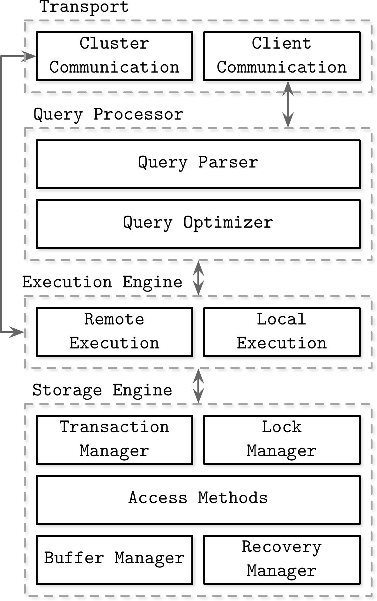

# Database Internals

## Chapter 1. Introduction and Overview

### DBMS Architecture

- Client/server model
  - Database system instances (nodes) = servers
  - Application instances = clients
- Transport
  - It's where client requests arrive.
  - Communicates with other nodes.
- Query processor
  - Parses, interprets, and validates queries.
- Execution engine
  - Collects results from execution.
  - Remote execution writes/reads data from other nodes.
- Storage engine executes local queries (from clients/other nodes)
  - Transaction manager schedules transactions and ensures they cannot leave DB in a logically inconsistent state.
  - Lock manager locks on DB objects to ensure concurrent operations don't violate physical data integrity.
  - Access methods manages access and organizing data on disk.
  - Buffer manager caches data pages in memory.
  - Recovery manager maintains the operation log and restoring the system state in case of a failure.

## Memory- Versus Disk-Based DBMS

### Memory-Based

- Maintain backups on disk to provide durability and prevent loss of the volatile data.
- A sorted disk-based structure.
- Modifications are asynchronous and applied in batches in reduce the number of I/O operations.
- Checkpointing: log records applied to backup in batches and logs prior to a specific point in time can be discarded.

### Disk-Based

- Use specialized storage structures optimized for disk access.
- Storage structures have a form of wide and short trees.

## Column- Versus Row-Oriented DBMS

### Row-Oriented

- Store data in records/rows, where every row has the same set of fields.
- Every row is uniquely identified by its key.
- Storing rows together improves spatial locality.
- Good for accessing an entire record, but more expensive for accessing individual fields of multiple records.

### Column-Oriented

- Store data in columns.
- Values of the same column are store continuously on disk.
- Good for queries by column (analytical workloads).
- To reconstruct data tuples, we need metadata to identify associated data from other columns.

### Wide Column Stores

- Data stored in multidimensional sorted map with hierarchical indexes.
  - Row indexed by its row key.
  - Related columns grouped together in column families.
  - Each column in a column family identified by its column key (column family name + qualifier).
