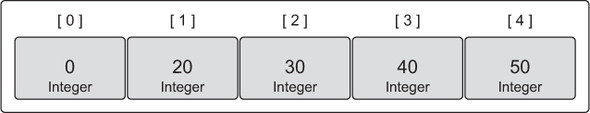
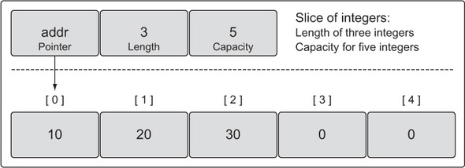
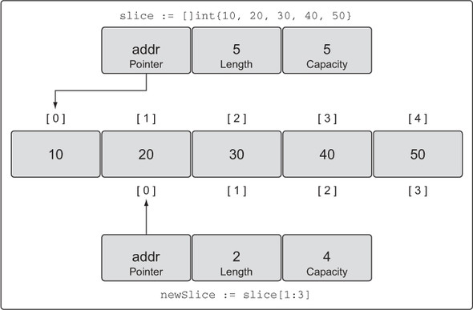
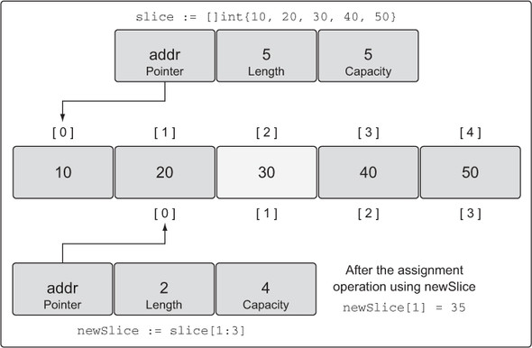
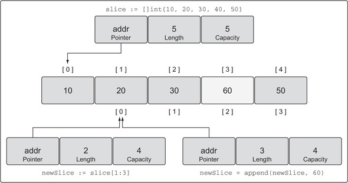
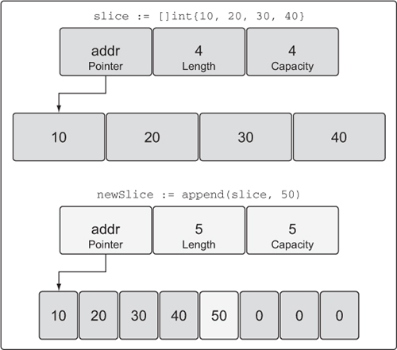
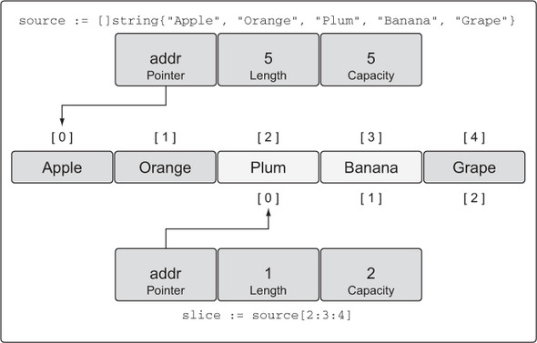
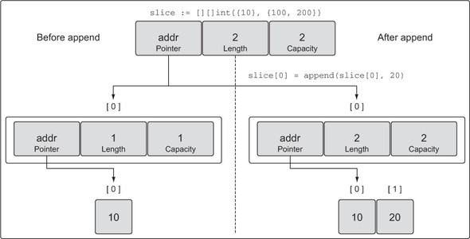

# Go in Action

[[toc]]

## Chapter 4. Arrays, slices, and maps

### 4.1. ARRAY INTERNALS AND FUNDAMENTALS

#### 4.1.1 Internals

An array is a fixed-length data type that contains a contiguous block of elements of the same type.



#### 4.1.2. Declaring and initializing

```go
// Declare an integer array of five elements.
var array [5]int
```

```go
// Declare an integer array of five elements.
// Initialize each element with a specific value.
array := [5]int{10, 20, 30, 40, 50}
```

```go
// Declare an integer array.
// Initialize each element with a specific value.
// Capacity is determined based on the number of values initialized.
array := [...]int{10, 20, 30, 40, 50}
```

```go
// Declare an integer array of five elements.
// Initialize index 1 and 2 with specific values.
// The rest of the elements contain their zero value.
array := [5]int{1: 10, 2: 20}
```

### 4.1.3. Working with arrays

```go
// Declare an integer array of five elements.
// Initialize each element with a specific value.
array := [5]int{10, 20, 30, 40, 50}

// Change the value at index 2.
array[2] = 35
```

```go
// Declare an integer pointer array of five elements.
// Initialize index 0 and 1 of the array with integer pointers.
array := [5]*int{0: new(int), 1: new(int)}

// Assign values to index 0 and 1.
*array[0] = 10
*array[1] = 20
```

```go
// Declare a string array of five elements.
var array1 [5]string

// Declare a second string array of five elements.
// Initialize the array with colors.
array2 := [5]string{"Red", "Blue", "Green", "Yellow", "Pink"}

// Copy the values from array2 into array1.
array1 = array2
```

```go
// Declare a string pointer array of three elements.
var array1 [3]*string

// Declare a second string pointer array of three elements.
// Initialize the array with string pointers.
array2 := [3]*string{new(string), new(string), new(string)}

// Add colors to each element
*array2[0] = "Red"
*array2[1] = "Blue"
*array2[2] = "Green"

// Copy the values from array2 into array1.
array1 = array2
```

### 4.1.4. Multidimensional arrays

```go
// Declare a two dimensional integer array of four elements
// by two elements.
var array [4][2]int

// Use an array literal to declare and initialize a two
// dimensional integer array.
array := [4][2]int{{10, 11}, {20, 21}, {30, 31}, {40, 41}}

// Declare and initialize index 1 and 3 of the outer array.
array := [4][2]int{1: {20, 21}, 3: {40, 41}}

// Declare and initialize individual elements of the outer
// and inner array.
array := [4][2]int{1: {0: 20}, 3: {1: 41}}
```

```go
// Declare a two dimensional integer array of two elements.
var array [2][2]int

// Set integer values to each individual element.
array[0][0] = 10
array[0][1] = 20
array[1][0] = 30
array[1][1] = 40
```

```go
// Declare two different two dimensional integer arrays.
var array1 [2][2]int
var array2 [2][2]int

// Add integer values to each individual element.
array2[0][0] = 10
array2[0][1] = 20
array2[1][0] = 30
array2[1][1] = 40

// Copy the values from array2 into array1.
array1 = array2
```

```go
// Copy index 1 of array1 into a new array of the same type.
var array3 [2]int = array1[1]

// Copy the integer found in index 1 of the outer array
// and index 0 of the interior array into a new variable of
// type integer.
var value int = array1[1][0]
```

### 4.1.5. Passing arrays between functions

Variables are passed by value by default. Use pointer type to have less memory consumption and better performance.

## 4.2. SLICE INTERNALS AND FUNDAMENTALS

### 4.2.1. Internals

Slices are tiny objects that abstract and manipulate an underlying array.



### 4.2.2. Creating and initializing

```go
// Create a slice of strings.
// Contains a length and capacity of 5 elements.
slice := make([]string, 5)
```

```go
// Create a slice of integers.
// Contains a length of 3 and has a capacity of 5 elements.
slice := make([]int, 3, 5)
```

```go
// Create a slice of integers.
// Make the length larger than the capacity.
slice := make([]int, 5, 3)

// Compiler Error:
// len larger than cap in make([]int)
```

```go
// Create a slice of strings.
// Contains a length and capacity of 5 elements.
slice := []string{"Red", "Blue", "Green", "Yellow", "Pink"}

// Create a slice of integers.
// Contains a length and capacity of 3 elements.
slice := []int{10, 20, 30}
```

```go
// Create a slice of strings.
// Initialize the 100th element with an empty string.
slice := []string{99: ""}
```

```go
// Create an array of three integers.
array := [3]int{10, 20, 30}

// Create a slice of integers with a length and capacity of three.
slice := []int{10, 20, 30}
```

```go
// Create a nil slice of integers.
var slice []int
```

- Useful when you want to represent a slice that doesn't exist.

```go
// Use make to create an empty slice of integers.
slice := make([]int, 0)

// Use a slice literal to create an empty slice of integers.
slice := []int{}
```

- Useful when you want to represent an empty collection.

### 4.2.3. Working with slices

```go
// Create a slice of integers.
// Contains a length and capacity of 5 elements.
slice := []int{10, 20, 30, 40, 50}

// Change the value of index 1.
slice[1] = 25
```

```go
// Create a slice of integers.
// Contains a length and capacity of 5 elements.
slice := []int{10, 20, 30, 40, 50}


// Create a new slice.
// Contains a length of 2 and capacity of 4 elements.
newSlice := slice[1:3]
```



```go
// Change index 1 of newSlice.
// Change index 2 of the original slice.
newSlice[1] = 35
```



```go
// Allocate a new element from capacity.
// Assign the value of 60 to the new element.
newSlice = append(newSlice, 60)
```



```go
// Append a new value to the slice.
// Assign the value of 50 to the new element.
newSlice := append(slice, 50)
```

- When there is no available capacity in the underlying array, the `append` function will create a new underlaying array, copy the existing values that are being referenced, and assign the new value.



```go
// Create a slice of strings.
// Contains a length and capacity of 5 elements.
source := []string{"Apple", "Orange", "Plum", "Banana", "Grape"}

// Slice the third element and restrict the capacity.
// Contains a length of 1 element and capacity of 2 elements.
slice := source[2:3:4]
```



```go
// Create a slice of strings.
// Contains a length and capacity of 5 elements.
source := []string{"Apple", "Orange", "Plum", "Banana", "Grape"}

// Slice the third element and restrict the capacity.
// Contains a length and capacity of 1 element.
slice := source[2:3:3]

// Append a new string to the slice.
slice = append(slice, "Kiwi")
```

### 4.2.4. Multidimensional slices

```go
// Create a slice of a slice of integers.
slice := [][]int{{10}, {100, 200}}

// Create a slice of a slice of integers.
slice := [][]int{{10}, {100, 200}}

// Append the value of 20 to the first slice of integers.
slice[0] = append(slice[0], 20)
```



```go
// Create two slices each initialized with two integers.
s1 := []int{1, 2}
s2 := []int{3, 4}

// Append the two slices together and display the results.
fmt.Printf("%v\n", append(s1, s2...))
```

```go
// Create a slice of integers.
// Contains a length and capacity of 4 elements.
slice := []int{10, 20, 30, 40}

// Iterate over each element and display each value.
for index, value := range slice {
  fmt.Printf("Index: %d  Value: %d\n", index, value)
}

// Iterate over each element and display each value.
for _, value := range slice {
    fmt.Printf("Value: %d\n", value)
}
```

- `range` returns a copy of the value, not a reference.
- `_` is a blank identifier to discard a value.

### 4.2.5 Passing slices between functions

```go
// Allocate a slice of 1 million integers.
slice := make([]int, 1e6)

// Pass the slice to the function foo.
slice = foo(slice)

// Function foo accepts a slice of integers and returns the slice back.
func foo(slice []int) []int {
    ...
    return slice
}
```
