# RabbitMQ in Depth

[[toc]]

## Chapter 1. Foundational RabbitMQ

### 1.3. THE ADVANTAGES OF LOOSELY COUPLED ARCHITECTURES

#### 1.3.6. The Advanced Message Queuing model (AMQ)

The AMQ defines 3 abstract components of a message broker:

- Exchange routes messages to queues.
- Queue stores messages.
- Binding tells an exchange which queue the messages should be stored in.

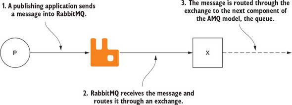

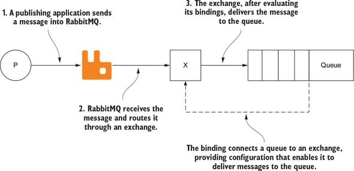

## Chapter 2. How to speak Rabbit: the AMQ Protocol

### 2.1. AMQP AS AN RPC TRANSPORT

#### 2.1.1. Kicking off the conversation

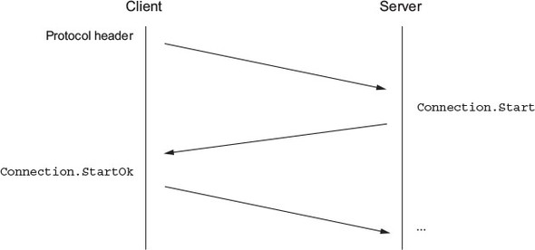

- Procedure to initiate a connection between a client and RabbitMQ.
- A sequence of 3 synchronous RPC requests to start, tune, and open the connection.

#### 2.1.2. Tuning in to the right channel

- A channel is a conversation isolated from other conversations.
- A single AMQP connection can have multiple channels, allowing multiple conversations (multiplexing).

### 2.2. AMQP’S RPC FRAME STRUCTURE

AMQP command = class + method

- Class defines a scope of functionality.
- Method performs a task.

#### 2.2.1. AMQP frame components

A low-level AMQP frame is composed of 5 components:

- Frame type
- Channel number
- Frame size in bytes
- Frame payload
- End-byte marker (ASCII value 206)

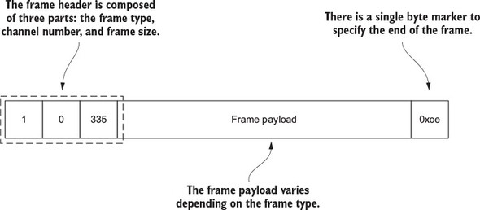

#### 2.2.2. Types of frames

- The protocol header frame is only used once, when connecting to RabbitMQ.
- A method frame carries with it the RPC request or response that’s being sent to or received from RabbitMQ.
- A content header frame contains the size and properties for a message.
- Body frames contain the content of messages.
- The heartbeat frame is sent to and from RabbitMQ as a check to ensure that both sides of the connection are available and working properly.

#### 2.2.3. Marshaling messages into frames

When publishing a message to RabbitMQ, the method, header, and body frames are used.

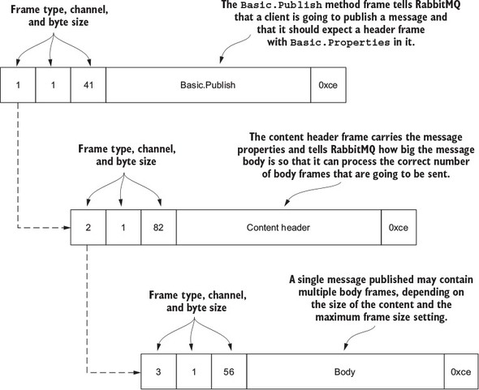

#### 2.2.4. The anatomy of a method frame

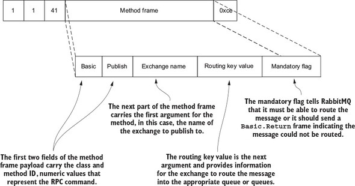

#### 2.2.5. The content header frame

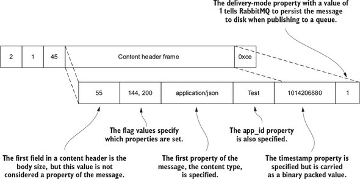

#### 2.2.6. The body frame

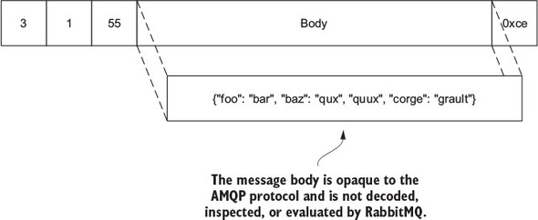

- The body frame for a message is agnostic to the type of data being transferred.

### 2.3. PUTTING THE PROTOCOL TO USE

#### 2.3.1. Declaring an exchange

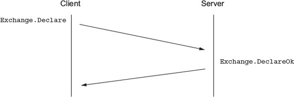

- `Exchange.Declare` declares the name of the exchange, its type, and other metadata.

#### 2.3.2. Declaring a queue

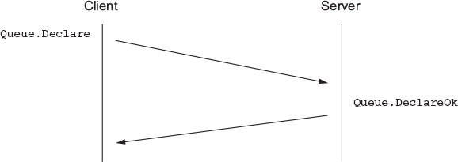

- To handle errors gracefully, the client should be listening for a `Channel.Close` command.

#### 2.3.3. Binding a queue to an exchange

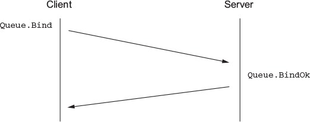

- `Queue.Bind` can only specify one queue at a time.

#### 2.3.4. Publishing a message to RabbitMQ

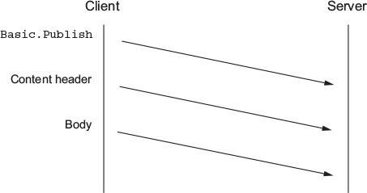

- If the exchange does not exist, RabbitMQ will silently drop the messages. To ensure delivery, set the mandatory flag to true or use delivery confirmations.

#### 2.3.5. Consuming messages from RabbitMQ

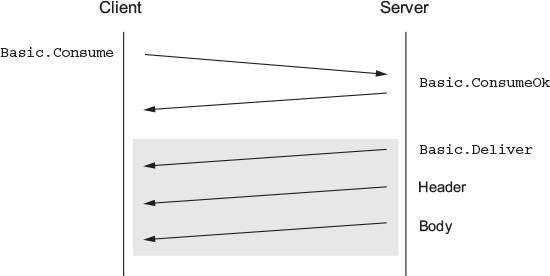

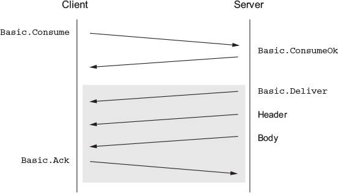

- To stop receiving messages, issue `Basic.Cancel` command.
  - Set `no_ark` to true: RabbitMQ will send messages continuously until the consumer sends a `Basic.Cancel` command or the consumer is disconnected.
  - Set `no_ark` to false: a consumer must acknowledge each message that it receives by sending a `Basic.Ack` RPC request.

## Chapter 3. An in-depth tour of message properties

|     Property     |     Type     | For use by  |                                                                    Suggested or specified use                                                                     |
| :--------------: | :----------: | :---------: | :---------------------------------------------------------------------------------------------------------------------------------------------------------------: |
|      app-id      | short-string | Application |                                                   Useful for defining the application publishing the messages.                                                    |
| content-encoding | short-string | Application |                                Specify whether your message body is encoded in some special way, such as zlib, deflate, or Base64.                                |
|   content-type   | short-string | Application |                                                      Specify the type of the message body using mime-types.                                                       |
|  correlation-id  | short-string | Application | If the message is in reference to some other message or uniquely identifiable item, the correlation-id is a good way to indicate what the message is referencing. |
|  delivery-mode   |    octet     |  RabbitMQ   |                            A value of 1 tells RabbitMQ it can keep the message in memory; 2 indicates it should also write it to disk.                            |
|    expiration    | short-string |  RabbitMQ   |                                 An epoch or Unix timestamp value as a text string that indicates when the message should expire.                                  |
|     headers      |    table     |    Both     |            A free-form key/value table that you can use to add additional metadata about your message; RabbitMQ can route based upon this if desired.             |
|    message-id    | short-string | Application |                                     A unique identifier such as a UUID that your application can use to identify the message.                                     |
|     priority     |    octet     |  RabbitMQ   |                                                            A property for priority ordering in queues.                                                            |
|    timestamp     |  timestamp   | Application |                                    An epoch or Unix timestamp value that can be used to indicate when the message was created.                                    |
|       type       | short-string | Application |                                          A text string your application can use to describe the message type or payload.                                          |
|     user-id      | short-string |    Both     |                    A free-form string that, if used, RabbitMQ will validate against the connected user and drop messages if they don’t match.                     |

## Chapter 5. Don’t get messages; consume them

### 5.1. BASIC.GET VS. BASIC.CONSUME

`Basic.Get` is a polling mode; `Basic.Consume` is a push model.

#### 5.1.1. Basic.Get

Send a new `Basic.Get` request to retrieve a message, even if there are multiple messages in the queue.

- RabbitMQ responds with `Basic.GetOk` if not empty, otherwise `Basic.GetEmpty`.

#### 5.1.2. Basic.Consume

`Basic.Consume` tells RabbitMQ to send messages asynchronously to until `Basic.Cancel` is issued.

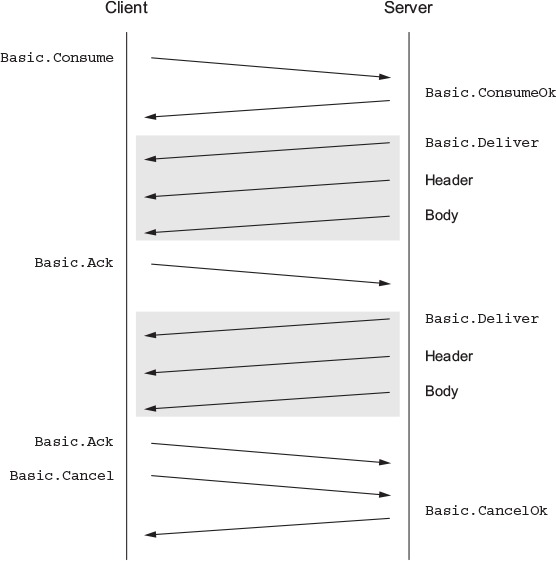

### 5.2. PERFORMANCE-TUNING CONSUMERS

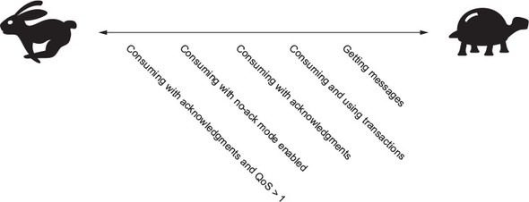
