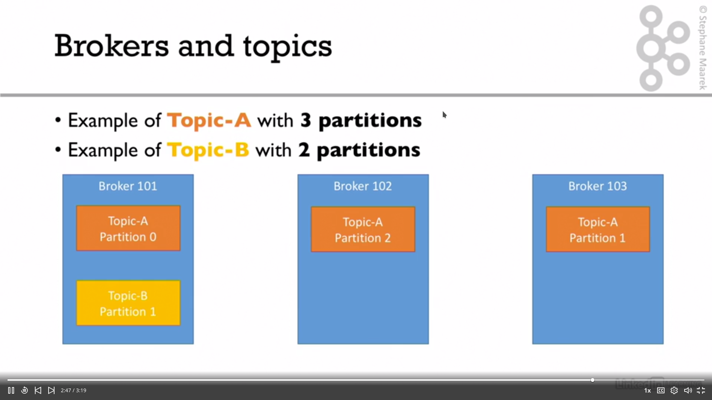

# Learn Apache Kafka for Beginners

## Kafka Theory

### Topics, partitions and offsets

- __Topic__: a particular stream of data.
  - similar to a table in a DB
  - defined by a name
  - you can have as many topics as you want
- Topics are split in partitions.
  - ordered partitions
  - incremental id (offset) for each partition
  - offset only has a meaning for a specific partition
  - order guaranteed only within the same partition
  - data only kept for a limited time
  - data cannot be mutated
  - data assigned randomly to a partition unless a key is provided

### Brokers and topics

- A kafka cluster is composed of multiple brokers (servers).
- Each broker is identified by its ID (integer).
- Each broker contains topic partitions.
- Connect to one broker => get metadata about the whole cluster

An example:

## Topic replication

- Topics should have a replication factor > 1 (2 or 3)
- If a broker is down, another broker can serve the data.
- At any time, only one broker can be a leader for a given partition.
- Only that leader can receive and serve data for the partition.
- The other brokers just synchronize the data.

