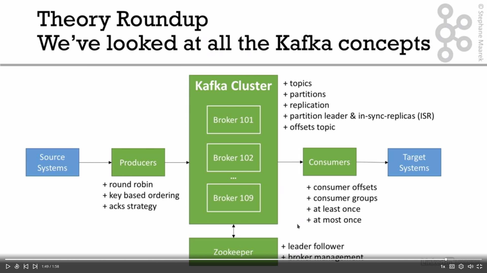

# Learn Apache Kafka for Beginners

## Kafka Theory

### Topics, partitions and offsets

- __Topic__: a particular stream of data.
  - similar to a table in a DB
  - defined by a name
  - you can have as many topics as you want
- Topics are split in partitions.
  - ordered partitions
  - incremental id (offset) for each partition
  - offset only has a meaning for a specific partition
  - order guaranteed only within the same partition
  - data only kept for a limited time
  - data cannot be mutated
  - data assigned randomly to a partition unless a key is provided

### Brokers and topics

- A kafka cluster is composed of multiple brokers (servers).
- Each broker is identified by its ID (integer).
- Each broker contains topic partitions.
- Connect to one broker => get metadata about the whole cluster

### Topic replication

- Topics should have a replication factor > 1 (2 or 3)
- If a broker is down, another broker can serve the data.
- At any time, only one broker can be a leader for a given partition.
- Only that leader can receive and serve data for the partition.
- The other brokers just synchronize the data.

### Producers and message keys

- Producers write data to topics.
- Producers automatically know which broker and partition to write to.
- Producers will automatically recover if case of broker failures.
- Producers can choose to receive acknowledgement of data writes:
  - `acks=0`: don't wait for ack (possible data loss)
  - `acks=1`: wait for leader ack (limited data loss)
  - `acks=all`: leader ack + replica acks (no data loss)
- Producers can choose to send a key with the message.
  - `key=null` => data sent round robin
  - key sent => all messages for the key go to the same partition

### Consumers & Consumer Groups

- Consumers read data from a topic.
- Consumers know which broker to read from.
- Consumers know how to recover in case of broker failures.
- Data is read in order within each partition.
- Consumers reads in consumer groups.
- Each consumer within a group reads from exclusive partitions.
- comsumers > brokers => some comsumers become inactive
